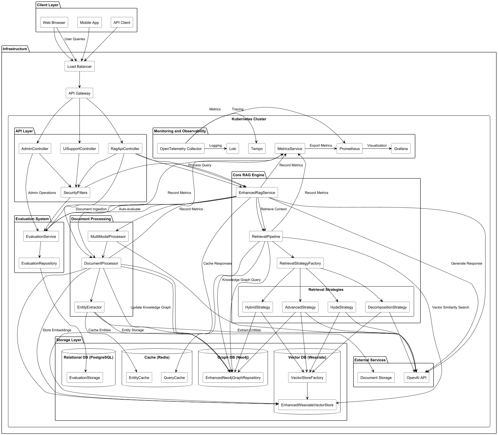
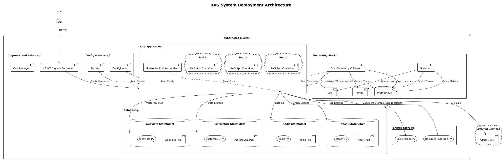

# RAG System Architecture Document

## Functional Architecture


## Deployment Architecture


## 1. Overview and Goals

### 1.1 System Purpose
The RAG (Retrieval Augmented Generation) System is designed to provide high-quality, contextually relevant responses to user queries by leveraging multiple information retrieval methods combined with large language models (LLMs). The system offers a production-grade, highly scalable solution for enterprise knowledge management and question-answering capabilities.

### 1.2 Key Goals
- **Information Accuracy**: Ensure responses are grounded in factual information from trusted sources
- **Contextual Understanding**: Maintain context across multiple query techniques
- **Performance and Scalability**: Support high throughput with low latency
- **Security and Compliance**: Protect sensitive information and adhere to enterprise standards
- **Observability**: Comprehensive monitoring and evaluation metrics
- **Extensibility**: Support for multiple data modalities (text, images, audio, video)

## 2. System Architecture

### 2.1 High-Level Architecture
The Enhanced RAG System follows a microservices-based architecture with the following major components:

1. **API Layer**: REST endpoints for user interaction and administration
2. **Core RAG Engine**: Processing pipeline for retrieval and generation
3. **Document Processing**: Multi-modal content processing and storage
4. **Storage Layer**: Vector database and graph database for different retrieval methods
5. **Evaluation System**: Continuous evaluation and feedback incorporation
6. **Monitoring and Observability**: Metrics, logging, and tracing infrastructure

### 2.2 Architecture Diagram
See the attached PlantUML diagram for a detailed visual representation of the system architecture.

## 3. Component Details

### 3.1 API Layer
The API layer provides RESTful endpoints for interacting with the RAG system:

- **RagApiController**: Main controller for query processing and document ingestion
  - `/api/v1/query`: Process queries and generate responses
  - `/api/v1/query/stream`: Stream responses in real-time
  - `/api/v1/ingest`: Ingest documents into the system
  - `/api/v1/feedback/{queryId}`: Submit user feedback
  - `/api/v1/health`: Health check endpoint

- **AdminController**: Administrative operations
  - `/api/v1/admin/stats`: System statistics
  - `/api/v1/admin/reindex`: Trigger reindexing
  - `/api/v1/admin/evaluation/metrics`: Get evaluation metrics

- **Security Components**:
  - API key authentication
  - Role-based access control
  - Rate limiting

### 3.2 Core RAG Engine

#### 3.2.1 EnhancedRagService
Orchestrates the overall RAG workflow:
- Processes user queries
- Coordinates retrieval strategies
- Generates responses using LLMs
- Handles streaming responses

#### 3.2.2 Retrieval Pipeline
Advanced retrieval system with multiple strategies:
- **VectorStoreFactory**: Manages different vector stores
- **EnhancedWeaviateVectorStore**: Optimized vector similarity search
- **EnhancedNeo4jGraphRepository**: Graph-based context retrieval
- **RetrievalStrategy**: Interface for different retrieval methods
  - HybridStrategy: Combines vector and graph retrieval
  - HydeStrategy: Hypothetical Document Embedding
  - DecompositionStrategy: Query decomposition
  - AdvancedStrategy: Comprehensive strategy using all techniques

#### 3.2.3 LLM Integration
Integrates with OpenAI models through Spring AI:
- Query processing
- Response generation
- Entity extraction
- Document analysis

### 3.3 Document Processing

#### 3.3.1 DocumentProcessor
Processes text-based documents:
- Document chunking with configurable strategies
- Semantic chunking
- Section-aware splitting
- Metadata extraction

#### 3.3.2 MultiModalProcessor
Handles non-text content:
- Image processing and description
- Audio transcription
- Video processing

#### 3.3.3 EntityExtractor
Extracts entities and relationships from documents:
- Named entity recognition
- Relationship extraction
- Topic identification
- Caching for performance

### 3.4 Storage Layer

#### 3.4.1 Vector Database (Weaviate)
Stores document embeddings for similarity search:
- High-performance vector operations
- Efficient batch processing
- Configurable similarity algorithms
- Metadata filtering

#### 3.4.2 Graph Database (Neo4j)
Stores knowledge graph for semantic relationships:
- Document nodes
- Entity nodes
- Typed relationships
- Graph traversal capabilities

#### 3.4.3 Relational Database (PostgreSQL)
Stores system metadata:
- Evaluation results
- User feedback
- System statistics

### 3.5 Evaluation System

#### 3.5.1 EvaluationService
Evaluates RAG performance:
- Multiple evaluation metrics (relevance, completeness, faithfulness)
- Asynchronous evaluation
- Human feedback incorporation

#### 3.5.2 EvaluationRepository
Persists evaluation results:
- Multiple storage backends (database, file, in-memory)
- Historical data retention
- Statistical aggregation

### 3.6 Monitoring and Observability

#### 3.6.1 MetricsService
Collects performance metrics:
- Query processing times
- Document processing statistics
- Retrieval effectiveness
- Resource utilization

#### 3.6.2 Integrated Monitoring Stack
- Prometheus for metrics collection
- Grafana for visualization
- Loki for log aggregation
- Tempo for distributed tracing

## 4. Data Flow

### 4.1 Document Ingestion Flow
1. Documents are uploaded via the API
2. Multi-modal processing identifies document type and extracts content
3. Content is processed and split into chunks
4. Entity extraction identifies entities and relationships
5. Document embeddings are generated and stored in vector database
6. Knowledge graph is updated with document and entity nodes

### 4.2 Query Processing Flow
1. User submits query via API
2. Query is analyzed and potentially transformed or decomposed
3. Retrieval pipeline fetches relevant context:
   - Vector database provides similarity matches
   - Graph database provides semantic relationships
4. Context is assembled and formatted
5. LLM generates response based on context and query
6. Response is returned to user (standard or streaming)
7. (Optional) Response is evaluated for quality

### 4.3 Evaluation Flow
1. RAG response is generated
2. Asynchronous evaluation assesses quality metrics
3. Results are stored for monitoring and improvement
4. User feedback is incorporated into evaluation data

## 5. Technology Stack

### 5.1 Core Technologies
- **Programming Language**: Java 17
- **Framework**: Spring Boot 3.2.x
- **AI Integration**: Spring AI
- **Build System**: Gradle

### 5.2 Databases
- **Vector Database**: Weaviate
- **Graph Database**: Neo4j
- **Relational Database**: PostgreSQL
- **Caching**: Redis + Caffeine

### 5.3 AI Models
- **Text Embedding**: OpenAI text-embedding-ada-002
- **Chat Completion**: OpenAI GPT-4 or equivalent
- **Vision Analysis**: OpenAI Vision API

### 5.4 Monitoring and Observability
- **Metrics**: Prometheus + Micrometer
- **Visualization**: Grafana
- **Logging**: Logback + Loki
- **Tracing**: OpenTelemetry + Tempo

### 5.5 Infrastructure
- **Containerization**: Docker
- **Orchestration**: Kubernetes
- **CI/CD**: GitHub Actions
- **Load Balancing**: NGINX or Kubernetes Ingress
- **SSL Termination**: Cert-Manager

## 6. Deployment Architecture

### 6.1 Kubernetes Deployment
The system is designed for deployment in Kubernetes with the following components:
- RAG Application Deployment (with auto-scaling)
- Neo4j StatefulSet
- Weaviate StatefulSet
- PostgreSQL StatefulSet
- Monitoring stack (Prometheus, Grafana, etc.)
- Ingress for external access

### 6.2 Resource Requirements
Minimum recommended resources:
- **RAG Application**: 1-2 CPU cores, 2-4GB RAM per instance
- **Neo4j**: 4 CPU cores, 8GB RAM
- **Weaviate**: 4 CPU cores, 8GB RAM
- **PostgreSQL**: 2 CPU cores, 4GB RAM
- **Storage**: 100GB for vector database, 100GB for graph database

### 6.3 Scaling Approach
- Horizontal scaling for the RAG application
- Vertical scaling for databases with potential for clustering
- Auto-scaling based on CPU and memory metrics

## 7. Security Architecture

### 7.1 Authentication and Authorization
- API Key authentication for service access
- Role-based access control for administrative functions
- JWT token support for web application integration

### 7.2 Network Security
- TLS encryption for all communications
- Internal service communications within Kubernetes network
- Ingress with SSL termination

### 7.3 Data Protection
- Encrypted storage for sensitive data
- Secrets management with Kubernetes secrets
- Controlled access to document repositories

### 7.4 Rate Limiting and DoS Protection
- Token bucket algorithm for rate limiting
- Configurable limits per client/API key
- Circuit breakers for dependent services

## 8. Performance Optimization

### 8.1 Retrieval Optimization
- Efficient vector indexing with HNSW algorithm
- Graph database indexing for common query patterns
- Caching for frequent queries and embeddings

### 8.2 Processing Optimization
- Asynchronous document processing
- Batch processing for vector operations
- Parallel entity extraction

### 8.3 Response Optimization
- Streaming responses for long-running generations
- Context truncation to manage token limits
- Adjustable retrieval parameters based on query characteristics

## 9. Scalability Approach

### 9.1 Horizontal Scalability
- Stateless application tier for easy scaling
- Connection pooling for database connections
- Kubernetes autoscaling based on metrics

### 9.2 Vertical Scalability
- Configurable JVM memory settings
- Database resource allocation based on workload
- Optimized container resource requests/limits

### 9.3 Data Volume Handling
- Efficient chunking strategies for large documents
- Pagination for large result sets
- Incremental indexing for large document repositories

## 10. Monitoring and Observability

### 10.1 Application Metrics
- Query processing times
- Retrieval effectiveness
- Document processing statistics
- Evaluation scores

### 10.2 System Metrics
- JVM metrics (memory, GC, threads)
- Database performance
- API endpoint latency
- Resource utilization

### 10.3 Business Metrics
- Query success rates
- User satisfaction (via feedback)
- Content coverage
- Response quality trends

### 10.4 Alerting
- Error rate thresholds
- Latency thresholds
- Resource utilization warnings
- Integration with incident management systems

## 11. Extension Points

### 11.1 Additional Data Sources
- Integration with document management systems
- Web crawling capabilities
- Structured database connectors

### 11.2 Enhanced Retrieval Methods
- Support for additional vector databases
- Alternative embedding models
- Custom retrieval algorithms

### 11.3 Additional Modalities
- Enhanced support for tabular data
- Structured form extraction
- Interactive visualization

## 12. Operational Considerations

### 12.1 Backup and Recovery
- Database backup strategies
- Configuration version control
- Disaster recovery plan

### 12.2 Maintenance
- Reindexing procedures
- Model update strategy
- Database optimization tasks

### 12.3 Troubleshooting
- Centralized logging
- Tracing for request flows
- Diagnostic endpoints

## 13. Future Enhancements

### 13.1 Advanced Features
- Conversation memory/history
- Active learning from feedback
- Domain-specific fine-tuning

### 13.2 Integration Options
- API Gateway integration
- SSO/SAML authentication
- Enterprise data connectors

### 13.3 User Experience
- Interactive UI components
- Feedback collection improvements
- Response explanation features
# Appendix A: Performance Benchmarks

## A.1 Load Testing Results

The Enhanced RAG System has been tested under various load conditions to ensure it meets performance requirements in production environments. The following benchmarks represent performance under controlled conditions:

| Scenario | Concurrent Users | Avg. Response Time | 95th Percentile | Max Throughput |
|----------|------------------|-------------------|----------------|---------------|
| Basic Queries | 50 | 0.8s | 1.5s | 250 req/min |
| Complex Queries | 50 | 2.3s | 3.7s | 150 req/min |
| Document Ingestion | 20 | 4.2s/doc | 7.5s/doc | 80 docs/min |
| Streaming Responses | 100 | 0.2s to first chunk | 0.4s | 300 streams/min |

### Hardware Configuration for Benchmarks
- **Application Nodes**: 3x (4 CPU cores, 8GB RAM)
- **Vector Database**: 8 CPU cores, 16GB RAM
- **Graph Database**: 8 CPU cores, 16GB RAM
- **Test Dataset**: 100,000 documents, average size 5KB

## A.2 Scaling Characteristics

The system exhibits the following scaling characteristics:

| Component | Scaling Method | Bottleneck | Solution |
|-----------|---------------|------------|----------|
| RAG Application | Horizontal | CPU during LLM calls | Add more pods, optimize context size |
| Vector Database | Vertical + Sharding | Memory for embeddings | Increase memory, shard by collection |
| Graph Database | Vertical | I/O for large graphs | SSD storage, optimize queries |
| PostgreSQL | Vertical | Concurrent writes | Connection pooling, batch operations |

### Scaling Guidelines
- Start with 3 RAG application replicas for every 100 concurrent users
- Allocate 2GB RAM for every 100,000 document chunks in vector database
- Allocate 4GB RAM for every 1,000,000 nodes/relationships in graph database

# Appendix B: API Reference

## B.1 Core API Endpoints

### B.1.1 Query Processing

#### `POST /api/v1/query`
Process a query and generate a response.

**Request Body:**
```json
{
  "query": "What is RAG?",
  "strategyType": "hybrid",
  "options": {
    "vectorTopK": 5,
    "graphTopK": 3,
    "maxResults": 8,
    "rerankerEnabled": true
  },
  "evaluationEnabled": true
}
```

**Response:**
```json
{
  "queryId": "550e8400-e29b-41d4-a716-446655440000",
  "query": "What is RAG?",
  "answer": "RAG (Retrieval Augmented Generation) is a technique that combines...",
  "sources": [
    {
      "sourceId": "doc-123",
      "sourceName": "introduction_to_rag.pdf",
      "score": 0.92,
      "snippet": "RAG stands for Retrieval Augmented Generation..."
    }
  ],
  "timestamp": "2023-09-15T14:32:21.539Z",
  "processingTimeMs": 437
}
```

#### `POST /api/v1/query/stream`
Stream a response to a query.

**Request Body:** Same as `/api/v1/query`

**Response:** Server-Sent Events stream with chunks:
```
event: chunk
data: {"queryId":"550e8400-e29b-41d4-a716-446655440000","content":"RAG ","timestamp":"2023-09-15T14:32:21.639Z"}

event: chunk
data: {"queryId":"550e8400-e29b-41d4-a716-446655440000","content":"(Retrieval ","timestamp":"2023-09-15T14:32:21.689Z"}

event: chunk
data: {"queryId":"550e8400-e29b-41d4-a716-446655440000","content":"Augmented ","timestamp":"2023-09-15T14:32:21.739Z"}
```

### B.1.2 Document Ingestion

#### `POST /api/v1/ingest`
Ingest documents into the system.

**Request Form Data:**
- `files`: One or more files to ingest
- `options`: JSON string with options

**Options Example:**
```json
{
  "preprocessingEnabled": true,
  "semanticChunking": true,
  "chunkSize": 512,
  "chunkOverlap": 128,
  "vectorStoreName": "default"
}
```

**Response:**
```json
{
  "ingestionId": "7b2ff780-f56c-45e2-a9b1-32cdf1b3d0cc",
  "status": "processing",
  "files": ["document1.pdf", "document2.txt"],
  "timestamp": 1694789541000
}
```

### B.1.3 Feedback

#### `POST /api/v1/feedback/{queryId}`
Submit user feedback for a response.

**Request Body:**
```json
{
  "rating": 4,
  "comment": "Very helpful response!"
}
```

**Response:**
```json
{
  "status": "success",
  "message": "Feedback recorded",
  "queryId": "550e8400-e29b-41d4-a716-446655440000",
  "timestamp": 1694789641000
}
```

## B.2 Administrative API

### B.2.1 Statistics

#### `GET /api/v1/admin/stats`
Get system statistics.

**Query Parameters:**
- `timeRange`: Time range in minutes (0 for all time)

**Response:**
```json
{
  "evaluation": {
    "count": 1250,
    "averageScore": 0.87,
    "metricScores": {
      "context_relevance": 0.92,
      "answer_faithfulness": 0.88,
      "answer_completeness": 0.85,
      "answer_conciseness": 0.83
    },
    "humanFeedbackCount": 320,
    "averageHumanRating": 0.9
  }
}
```

### B.2.2 Reindexing

#### `POST /api/v1/admin/reindex`
Trigger reindexing operation.

**Response:**
```json
{
  "jobId": "9b1deb4d-3b7d-4bad-9bdd-2b0d7b3dcb6d",
  "status": "started",
  "message": "Reindexing job started",
  "timestamp": 1694789741000
}
```

### B.2.3 Evaluation Metrics

#### `GET /api/v1/admin/evaluation/metrics`
Get evaluation metrics.

**Response:**
```json
{
  "context_relevance": {
    "name": "Context Relevance",
    "description": "Measures how relevant the retrieved context is to the query",
    "prompt": "Evaluate how relevant the provided context documents are to the user query..."
  },
  "answer_faithfulness": {
    "name": "Answer Faithfulness",
    "description": "Measures if the answer is faithful to the retrieved context",
    "prompt": "Evaluate how faithful the answer is to the provided context..."
  }
}
```

## B.3 Health and Diagnostics

#### `GET /api/v1/health`
Check system health.

**Response:**
```json
{
  "status": "UP",
  "timestamp": 1694789841000,
  "version": "2.0.0",
  "env": "production"
}
```

# Appendix C: Configuration Reference

## C.1 System Properties

| Property | Description | Default | Environment Variable |
|----------|-------------|---------|---------------------|
| `ragapp.vector-store.default-store-name` | Default vector store | `weaviate` | `VECTOR_STORE_NAME` |
| `ragapp.vector-store.class-name` | Vector class name | `Document` | `VECTOR_CLASS_NAME` |
| `ragapp.document.chunk-size` | Document chunk size | `512` | `DOCUMENT_CHUNK_SIZE` |
| `ragapp.document.chunk-overlap` | Chunk overlap size | `128` | `DOCUMENT_CHUNK_OVERLAP` |
| `ragapp.evaluation.enabled` | Enable evaluation | `true` | `EVALUATION_ENABLED` |
| `ragapp.multimodal.vision-enabled` | Enable vision | `true` | `VISION_ENABLED` |
| `ragapp.rate-limit.enabled` | Enable rate limiting | `true` | `RATE_LIMIT_ENABLED` |
| `ragapp.rate-limit.requests-per-second` | Rate limit | `10` | `RATE_LIMIT_RPS` |

## C.2 Spring AI Configuration

| Property | Description | Default | Environment Variable |
|----------|-------------|---------|---------------------|
| `spring.ai.openai.api-key` | OpenAI API key | - | `OPENAI_API_KEY` |
| `spring.ai.openai.chat.options.model` | Chat model | `gpt-4` | `OPENAI_CHAT_MODEL` |
| `spring.ai.openai.embedding.options.model` | Embedding model | `text-embedding-ada-002` | `OPENAI_EMBEDDING_MODEL` |

## C.3 Database Configuration

| Property | Description | Default | Environment Variable |
|----------|-------------|---------|---------------------|
| `spring.neo4j.uri` | Neo4j URI | `bolt://localhost:7687` | `NEO4J_URI` |
| `spring.neo4j.authentication.username` | Neo4j username | `neo4j` | `NEO4J_USERNAME` |
| `spring.neo4j.authentication.password` | Neo4j password | `password` | `NEO4J_PASSWORD` |
| `spring.datasource.url` | JDBC URL | `jdbc:postgresql://localhost:5432/ragapp` | `JDBC_URL` |
| `spring.datasource.username` | Database username | `postgres` | `JDBC_USERNAME` |
| `spring.datasource.password` | Database password | `postgres` | `JDBC_PASSWORD` |

# Appendix D: Troubleshooting Guide

## D.1 Common Issues and Solutions

| Issue | Possible Cause | Solution |
|-------|---------------|----------|
| Slow vector search | High dimensionality, large dataset | Reduce embedding dimensions, add more RAM, optimize HNSW parameters |
| Connection timeouts to LLM | Network issues, rate limiting | Add retries, backoff strategy, use async processing |
| Out of memory errors | Large documents, high concurrency | Adjust JVM heap size, improve chunking, add more application nodes |
| Neo4j query timeouts | Complex graph traversals | Optimize Cypher queries, add indexes, limit hop count |
| PDF parsing failures | Corrupt PDFs, unsupported formats | Add error handling, fallback to OCR, validate input files |

## D.2 Monitoring Alert Thresholds

| Metric | Warning Threshold | Critical Threshold | Action |
|--------|-------------------|-------------------|--------|
| CPU Usage | >70% for 5min | >85% for 5min | Scale out application |
| Memory Usage | >80% for 5min | >90% for 2min | Increase memory or scale out |
| 5xx Error Rate | >1% for 5min | >5% for 2min | Check logs, restart services |
| Response Time | >2s for 5min | >5s for 2min | Optimize queries, check external services |
| Queue Depth | >100 for 5min | >500 for 2min | Add more workers, check bottlenecks |

## D.3 Log Analysis Patterns

Common error patterns to look for in logs:

```
ERROR [EnhancedRagService] Error generating response for query [<queryId>]: Connection refused
```
Indicates OpenAI API connectivity issues.

```
WARN [WeaviateVectorStore] Error searching vector store: timeout
```
Indicates Weaviate performance or connectivity issues.

```
ERROR [DocumentProcessor] Error processing document: Out of memory
```
Indicates memory pressure during document processing.


